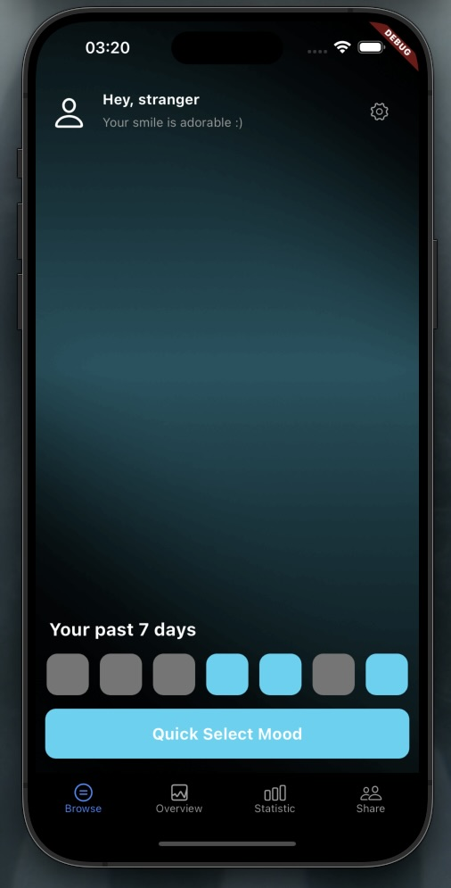

# mood

A RESTful API for mood tracking



## Getting Started

### Prerequisites

- [Java 21 (GraalVM)](https://www.graalvm.org/downloads/)
- [Gradle](https://gradle.org/install/)
- [Docker](https://docs.docker.com/get-docker/)

### Installation

Build the application:

```bash
gradle build
```

Run the application:

```bash
gradle quarkusDev
```

## Qodana

https://qodana.cloud/projects/zqPvd

## License

This program is licensed under the MIT-License. See the "LICENSE" file for more information
